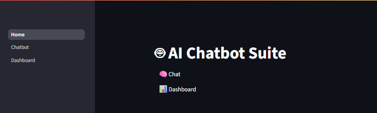
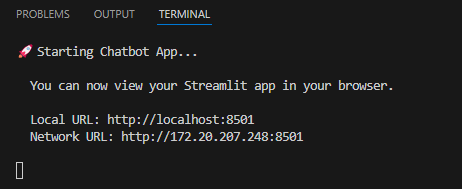
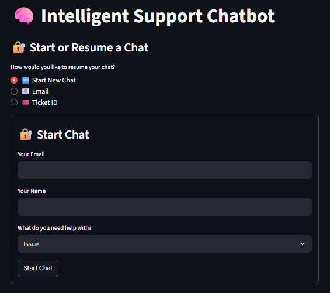
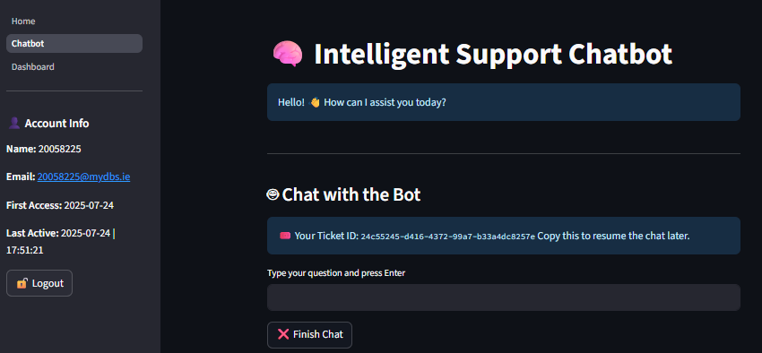
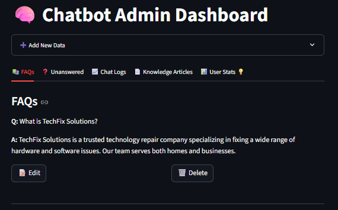
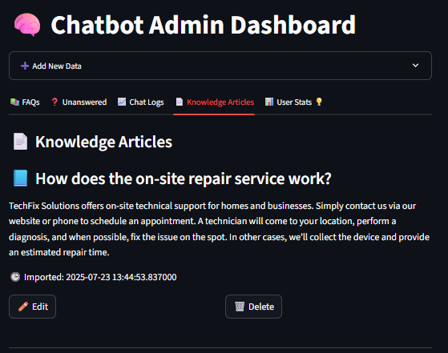
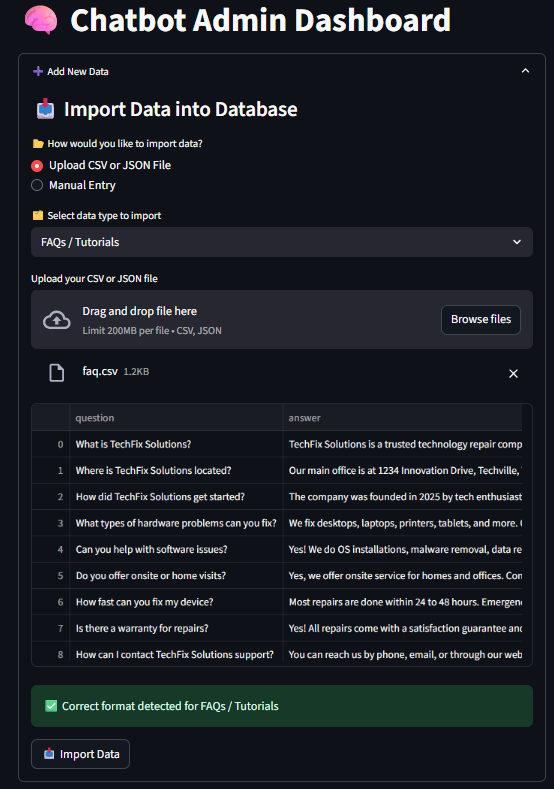
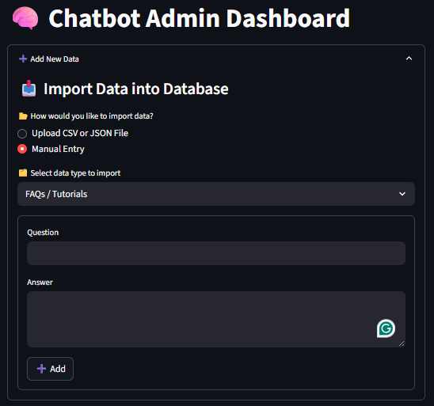

# 🤖 AI Chatbot Suite

A Streamlit-based AI Chatbot application with support for sentiment and priority classification of helpdesk tickets, FAQ import, and MongoDB integration. Includes training pipelines using machine learning models stored locally.

---

## 🚀 Features

- 📥 Import FAQs, default messages, or knowledge articles via CSV, JSON, or manual form.
- 🧠 Chatbot interface powered by OpenAI (via API key).
- 🧪 Sentiment & priority detection using pre-trained ML models (`joblib` pipelines).
- 📊 Admin dashboard for chat insights.
- 🐳 Docker & GitHub Actions integration for CI/CD.

---

## 🧰 Technologies

- Python 3.11
- Streamlit- MongoDB (via `pymongo`)
- scikit-learn, joblib
- Docker- GitHub Actions

---

## 📂 Project Structure
```
.
├── ml/
│   ├── models/
│   │   ├── kmeans_model.joblib
│   │   ├── priority_pipeline.joblib
│   │   └── sentiment_pipeline.joblib
│   ├── priority.py
│   └── sentiment.py
├── data/
│   ├── questions.txt
│   └── train_model.csv
├── pages/
│   ├── Chatbot.py
│   └── Dashboard.py
├── services/
│   ├── db.py
│   ├── import_file.py
│   ├── ml.py
│   ├── mongo.py
│   ├── monitoring.py
│   └── utils.py
├── simulation/
│   ├── result/
│   ├── script_bert.py
│   └── simulate_chat_tests.py
├── tests/
│   ├── test_get_ai_reply.py
│   ├── test_health.py
│   ├── test_mongo.py
│   ├── test_priority.py
│   ├── test_sentiment.py
│   └── test_services.py
├── logs/
│   └── chatbot-<timestamp>.log
├── config/
│   └── .env
├── assets/
│   └── [images/screenshots]
├── .github/
│   └── workflows/
│       └── chatbot-app.yml
├── Home.py
├── Dockerfile
├── env.sh
├── requirements.txt
├── start.sh
├── README.md
└── .gitignore
```

---

## ⚙️ Setup Instructions

### 🔧 Local (with Virtual Environment)

```bash
# Clone repo and move into folder
git clone https://github.com/20058225/chatbot-app.gitcd chatbot-app
# Create venv and activate it
python3 -m venv myenvsource myenv/bin/activate
# Install dependencies
pip install -r requirements.txt
# Run the app
streamlit run Home.py
```
Or use:
```
bash start.sh
```

---

## 🐳 Run with Docker
```
# Build Docker image
docker build -t chatbot-app .

# Run container
docker run -p 8501:8501 --env-file=config/.env chatbot-app
```

---

## 🔐 Environment Variables (.env)
Place this file in config/.env:

```
API_MONGO=mongodb+srv://<your-connection>
OPENAI_API_KEY=sk-...
EMAIL_ADMIN=your@email.com
EMAIL_PASS=your-app-password
```

---

## ✅ Run Tests
```
pytest tests/
```

---

## 🧠 ML Models
```
ml/models/sentiment_pipeline.joblib: Sentiment classifier (positive/neutral/negative)

ml/models/priority_pipeline.joblib: Ticket priority classifier (High/Medium/Low)

Both loaded at startup by services/utils.py.
```

---

## 🗃️ Sample Data Format (data/train_model.csv)

This dataset is used to train and evaluate both ML pipelines:

- **Sentiment classification** → `positive`, `neutral`, `negative`
- **Priority classification** → `High`, `Medium`, `Low`

---

### 🔍 Example rows:
```
.csv
description,sentiment,priority
"I can't log in to my account",negative,High
"My computer is running slow",negative,Medium
"How do I reset my email password?",neutral,Medium
"The printer is showing a paper jam error",negative,Medium
"Request for software upgrade",neutral,Low
"Thank you for fixing my internet issue",positive,Low
```

---

## 🔄 CI/CD with GitHub Actions

- Triggers on push to main

- Installs dependencies and runs pytest

- Builds Docker image for deploymentSee .github/workflows/chatbot-app.yml.

---

## 📄 License

MIT © 2025 Brenda Lopes — [LICENSE](./LICENSE)

---

## ✨ Screenshots

### 🤖 Home Interface


### 🤖 Terminal


### 🤖 Chatbot Interface
 
---


### 📊 Admin Dashboard

---


---

### 📥 FAQ & Default Message Import

---


---

## 🙋‍♀️ About
This project was developed as part of the MSc in Computing & Information Systems at Dublin Business School. The goal is to improve ticket triage using NLP, ML and a chatbot interface.

```

```